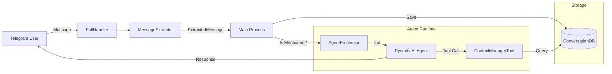
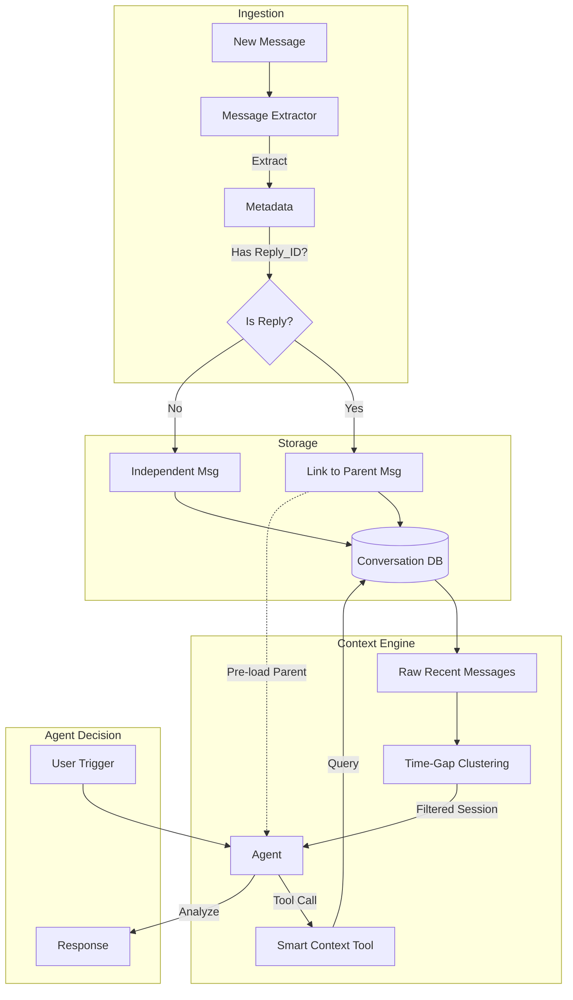
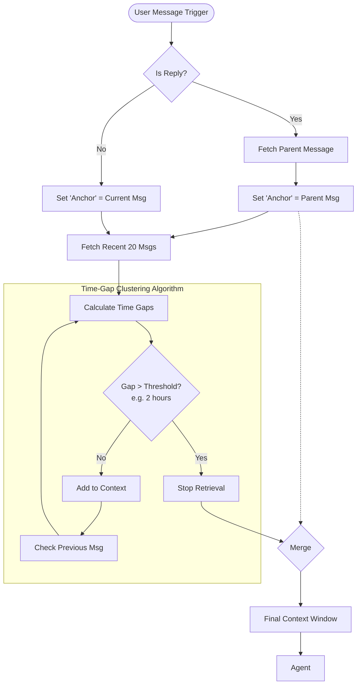

# Use cases

## Story 1

1. In the chat, users chat with each other.  
2. Suddenly, there is a conversation that needs the bot to help.   
3. Instead of summarizing the content and write a single request and tag bot, the user just tags bot and asks bot to chime in with generic questions that implicitly ask bot to look at the conversation. Like “@bot what do you think”, “@bot can you help”, “@bot ^”  
4. The bot should understand that user’s intention, and then look at the conversation to fetch the relevant context and answer user’s question.

## Story 2

1. In the chat, users chat with each other.  
2. Suddenly, there is a conversation that needs the bot to help.   
3. Instead of summarizing the content and write a single request and tag bot, the user just tags bot and asks bot to chime in by replying a message that needs the bot to look into.  
4. The bot should understand that user’s intention, and then look at the conversation to fetch the relevant context and answer user’s question.

# Challenge

1. Not all previous messages are relevant to the “latest” conversation. Based on time of previous message and the content, a message might be relevant or not.  
2. Let’s say there are 5 messages previous to the tag, e.g., A, B, C, D, E. And it’s possible that only A, C, D is relevant.  
3. Although time can give us some ideas, it's not always accurate. For example, in the following conversation, all messages are relevant:  
   1. Msg A (sent 3 days earlier): We should look at the restaurant for the gathering  
   2. Msg B (sent 2 days earlier): Any thoughts?  
   3. Msg C (sent 10 mins earlier): The thai restaurant on 10th Ave?  
   4. Msg D (sent just now): @bot

# Non-Goal

* We don’t address multiple messages between users and bot now. I.e., the bot only processes the message with the existing data, it shouldn’t expect follow up conversation. It can point out what is needed information for the user to provide, the user shouldn’t expect a simple reply will work. The user should tag the bot again, potentially reply the latest relevant message

# Current architecture

This report analyzes the existing architecture of the Personal Agent System in the context of the proposed "Contextual Conversation Chime-in" features.

## 1. High-Level Data Flow

The system follows a linear pipeline where messages are ingested, stored, and then selectively processed by the agent if a mention is detected.



## 2. Component Analysis

### Message Ingestion & Extraction
*   **Location**: `src/telegram/message_extractor.py`
*   **Mechanism**: The `MessageExtractor` parses raw Telegram updates into an `ExtractedMessage` object.
*   **Limitation**: It currently ignores the `reply_to_message` field in the Telegram update. While the full payload is stored as raw JSON in the database, it is not readily accessible to the agent or the processing logic.

### Data Storage
*   **Location**: `src/context/conversation_db.py`
*   **Schema**:
    ```sql
    CREATE TABLE messages (
        id INTEGER PRIMARY KEY,
        chat_id INTEGER,
        user_id INTEGER,
        message_text TEXT,
        role TEXT,
        timestamp TEXT,
        message_id INTEGER,
        raw_json TEXT
    )
    ```
*   **Limitation**: The database lacks a `reply_to_message_id` column. Retrieving a message thread requires parsing raw JSON for every message in a chat, which is inefficient.

### Context Management
*   **Location**: `src/main.py` & `src/context/context_manager.py`
*   **Current Logic**:
    *   **Empty Start**: The agent starts with an empty message history to keep the initial prompt small.
    *   **Pull Model**: The agent must explicitly use the `get_conversation_history` tool to fetch previous messages.
    *   **Fixed Window**: The tool only supports fetching the last N messages (default 5) in strict chronological order.

## 3. Gap Analysis vs. Proposal

| Requirement | Current Status | Architecture Gap |
| :--- | :--- | :--- |
| **Story 1: Generic Mentions** ("@bot what do you think?") | **Partially Supported.** | Retrieval is strictly chronological. The agent can see the last 5 messages but has no logic to determine which ones are *relevant* if the conversation spans a longer time or multiple topics. |
| **Story 2: Reply Tagging** | **Unsupported.** | The `MessageExtractor` does not surface `reply_to` metadata, and the `ConversationDB` does not index it. The agent cannot "see" what message it is replying to. |
| **Challenge: Relevance Filtering** | **Unsupported.** | No semantic or heuristic filtering exists. Retrieval is limited to "the last N messages". |

## 4. Recommended Architectural Changes

1.  **Update `ExtractedMessage`**: Include a `reply_to_id` field.
2.  **Update `ConversationDB`**: Add a `reply_to_id` column and index it.
3.  **Enhance `ContextManagerTool`**: 
    *   Allow fetching specific messages by ID (for replies).
    *   Implement basic heuristic filtering (e.g., "all messages in the last 20 minutes" or "messages in this reply chain").
4.  **Semantic Search Integration**: Leverage the existing `VectorStore` to allow the agent to search for "relevant context" rather than just "recent context".


# Key feature: Contextual "Look Back" & Reply Handling

## 1. Executive Summary
To enable the bot to "look back" intelligently (Story 1) and understand specific replies (Story 2), we propose a two-pronged approach:
1.  **Explicit Context (Hard Link):** Capture Telegram's `reply_to_message_id` to instantly provide the specific message the user tagged.
2.  **Heuristic Context (Soft Link):** Implement a "Time-Clustered Retrieval" algorithm to automatically identify the boundaries of the "current conversation," filtering out irrelevant older messages based on time gaps.

## 2. Proposed Architecture

We will modify the data flow to capture relationships between messages and give the Agent smarter tools to traverse them.



## 3. Implementation Details

### A. Database & Extraction Updates (The Foundation)
Currently, `reply_to_message` is ignored. We will surface this to anchor the context.

*   **Schema Change:** Add `reply_to_id` (int) and `thread_id` (int) to the `messages` table.
*   **Ingestion Logic:**
    *   When a message comes in, check `update.message.reply_to_message`.
    *   Store the parent message's ID in the new `reply_to_id` column.
    *   (Optional) If the parent message is not in our DB (pre-dates bot), store its text in a `context_snapshot` column.

### B. "Story 2" Solution: Explicit Reply Handling
When a user tags the bot in a reply to another message (e.g., replying to Msg C with "@bot"), the bot shouldn't need to "search" for Msg C. It should be given immediately.

*   **Action:** Modify `AgentProcessor` to accept an optional `related_context` parameter.
*   **Logic:**
    *   If `reply_to_id` exists, fetch that specific parent message.
    *   Inject it into the Agent's system prompt or initial context as:
        > "User is replying to this specific message: '[Content of Msg C]'"

### C. "Story 1" Solution: Smart Time-Clustering
For generic tags ("@bot thoughts?"), the bot needs to decide *which* previous messages are relevant. The simple "last 5 messages" approach fails if the previous message was 3 days ago.

*   **New Algorithm: Time-Gap Clustering**
    *   **Concept:** A conversation "session" is defined by a stream of messages with no gap larger than $T$ (e.g., 60 minutes).
    *   **Logic:**
        1.  Fetch last $N$ (e.g., 20) messages.
        2.  Iterate backwards from the current message.
        3.  Calculate $\Delta t$ (time difference) between $Message_n$ and $Message_{n-1}$.
        4.  If $\Delta t > Threshold$ (e.g., 2 hours), stop. The messages before this gap are likely a different conversation context.
        5.  Return only the messages in the current "cluster".

    *   **Example (from your prompt):**
        *   Msg A (3 days ago)
        *   Msg B (2 days ago)
        *   *(Gap > 2 hours)* -> **Cutoff Point**
        *   Msg C (10 mins ago)
        *   Msg D (Now: "@bot")
    *   **Result:** The bot only sees Msg C and D. It ignores A and B, effectively solving the "irrelevant history" challenge.

## 4. User Flows

### Story 1: The "Generic Lookback"
1.  **User:** "@bot what do you think?"
2.  **System:**
    *   Detects mention. No specific reply link.
    *   Invokes Agent.
3.  **Agent:**
    *   Receives message.
    *   Calls `get_smart_context(max_gap_minutes=60)`.
4.  **Tool:**
    *   Scans DB. Finds the "current session" started 15 mins ago (Msg C).
    *   Returns only Msg C and D.
5.  **Agent:** "I think the Thai restaurant (Msg C) sounds good."

### Story 2: The "Specific Reply"
1.  **User:** (Replying to Msg A from 3 days ago) "@bot is this still open?"
2.  **System:**
    *   Detects mention AND `reply_to_id` pointing to Msg A.
    *   Fetches Msg A from DB (or context snapshot).
    *   **Injects Context:** "User is replying to: 'We should look at the restaurant...'"
3.  **Agent:**
    *   Has the specific target immediately.
    *   (Optional) Calls `get_smart_context` to see if there was recent discussion, but primarily focuses on Msg A.
4.  **Agent:** "That restaurant mentioned 3 days ago is open until 10 PM."

## 5. Next Steps
1.  **Migration:** Add `reply_to_id` to database.
2.  **Code:** Update `MessageExtractor` to capture reply metadata.
3.  **Logic:** Implement the `Time-Gap` logic in `ConversationDB` or `ContextManager`.


# Key feature: Intelligent Context Retrieval ("Anchored Time-Clustering")

## 1. The Core Concept
To solve the challenge of distinguishing "relevant recent history" from "irrelevant old history" (Story 1) while respecting specific references (Story 2), we propose a hybrid retrieval strategy called **Anchored Time-Clustering**.

This strategy relies on two key signals:
1.  **The Anchor:** Is the user explicitly pointing to a specific message? (Reply-to-ID).
2.  **The Cluster:** What is the "active session"? (Defined by time density).

## 2. The Logic Flow



## 3. The Algorithm: "Time-Gap Clustering"

This algorithm addresses the **Challenge** scenario where "time can give us some ideas." It dynamically determines the start of the conversation.

**Parameters:**
*   `LOOKBACK_LIMIT`: Max messages to inspect (e.g., 20).
*   `TIME_THRESHOLD`: Max allowed silence between messages to consider them part of the *same* conversation (e.g., 60 minutes).

**Pseudocode Logic:**
```python
def get_smart_context(current_message, threshold_minutes=60):
    # 1. Start with the message the user sent (or the one they replied to)
    context_window = [current_message]
    
    # 2. Get recent history from DB (descending order)
    history = db.fetch_messages(limit=20)
    
    previous_timestamp = current_message.timestamp
    
    # 3. Iterate backwards
    for msg in history:
        # Calculate gap between this message and the one after it
        gap = previous_timestamp - msg.timestamp
        
        if gap.minutes > threshold_minutes:
            # GAP DETECTED: This message belongs to an older session.
            # Stop adding messages.
            break
            
        context_window.append(msg)
        previous_timestamp = msg.timestamp
        
    return reverse(context_window) # Return chronological order
```

### Scenario Analysis

#### Scenario A: The "Gap" (From your challenge)
> Msg A (3 days ago)
> Msg B (2 days ago)
> ... Gap of 48 hours ...
> Msg C (10 mins ago)
> Msg D (Now: "@bot thoughts?")

1.  Bot starts at **D**.
2.  Fetches history.
3.  Checks **C**: Gap is 10 mins (< 60m). **Keep C.**
4.  Checks **B**: Gap is 48 hours (> 60m). **STOP.**
5.  **Result:** Context is `[C, D]`. Msg A and B are correctly ignored.

#### Scenario B: The "Deep Reply" (Story 2)
> Msg A (3 days ago)
> ...
> Msg D (Now, replying to A): "@bot help with this"

1.  **Anchor** is **Msg A**.
2.  Bot fetches **Msg A** specifically via `reply_to_id`.
3.  Bot runs clustering from **D** backwards.
    *   Likely finds nothing else recent.
4.  **Result:** Context is `[Msg A (Anchor), Msg D (Current)]`.
5.  The bot sees the specific context (A) even though it's old, because it was explicitly linked.

## 4. Proposed Database Changes

To enable this, we need to modify the schema to support efficient retrieval of specific IDs and threading.

| Table | Change | Reason |
| :--- | :--- | :--- |
| `messages` | Add `reply_to_id` (INTEGER, Indexed) | To instantly fetch the "Anchor" message. |
| `messages` | Add `is_bot` (BOOLEAN) | To easily distinguish user vs assistant in logic. |
| `messages` | Index on `timestamp` | Critical for efficient time-gap queries. |

## 5. Implementation Strategy

1.  **Step 1: Schema Migration**
    *   Update `ConversationDB` to support `reply_to_id`.
2.  **Step 2: Ingestion Upgrade**
    *   Update `MessageExtractor` to capture `reply_to_message_id`.
3.  **Step 3: Context Manager Logic**
    *   Implement `get_smart_context(chat_id, anchor_id=None)` method.
    *   This method implements the Time-Gap loop.
4.  **Step 4: Tool Update**
    *   Update `ContextManagerTool` to default to this "Smart" retrieval instead of the blind `limit=5`.