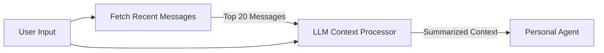

# PROPOSAL 002: LLM-Based Context Manager

## Objective
Replace the existing default context manager with a new `LLMContextManager` that intelligently curates conversation history using a Large Language Model (LLM). Instead of a simple fixed-window or time-based retrieval, this approach leverages an LLM to identify and summarize only the messages relevant to the user's latest input.

## Motivation
Standard context managers often rely on fetching the last $N$ messages. This can be inefficient or ineffective when:
1.  The relevant context is buried deeper in the history than the fixed window allows.
2.  The recent history contains "noise" or interleaved conversations that distract the agent.
3.  The agent needs a synthesized understanding of the context rather than a raw list of messages.

## Proposed Solution

The new context manager will operate on a "Fetch & Summarize" model:

1.  **Fetch**: Retrieve the most recent $N$ messages from the conversation history (defaulting to 20).
2.  **Filter & Summarize**: Pass these messages along with the user's latest input to an LLM.
3.  **Output**: The LLM returns a focused context summary containing only information relevant to the current request.

### workflow

## Configuration

 The system should be configurable via a YAML file (e.g., `context_config.yaml`).

| Parameter | Default | Description |
| :--- | :--- | :--- |
| `message_limit` | `20` | The number of recent references/messages to pull from the database for consideration. |
| `model_name` | *(Default Agent Model)* | The LLM model to use for the summarization step. |

## The Prompt

The core of this logic relies on a specific prompt designed to filter noise and extract signal. The context manager will send the following instruction to the LLM:

> "picked the relevant message and a generate a context from the following previous messages. The users latest input is provided, you should pick the messages that are related to the users current input, and summarize them into the context"

## Implementation Plan

1.  **Create `LLMContextManager` Class**: A new class implementing the context manager interface.
2.  **Config Integration**: Read `message_limit` from the application configuration.
3.  **LLM Integration**: Implement the call to the LLM with the retrieved history and the specified prompt.
4.  **Replacement**: Update the main agent runtime to use this new context manager by default or via a toggle.
